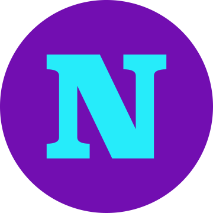

#  The Netlabel Guide

The Netlabel Guide’s goal will be to act as a central hub for music lovers to find great music online via netlabel culture.

We also plan on educating listeners on the importance of downloading and purchasing music as a direct way to show support to artists and labels. 

Currently streaming has siphened much of the world’s listener attention which has ultimately lead to a sort of anonymization of independent music. Current streaming platforms do a great job of convincing independent artists and labels to participate, however they do a poor job of allowing those artists/labels to utilize those platforms to better promote their downloads and physical products. Right now, less people are actively seeking out music outside of streaming platforms and this is leading to a devaluation of music. There has to be a better way to make listeners aware of and enjoy great independent music beyond streaming platforms.